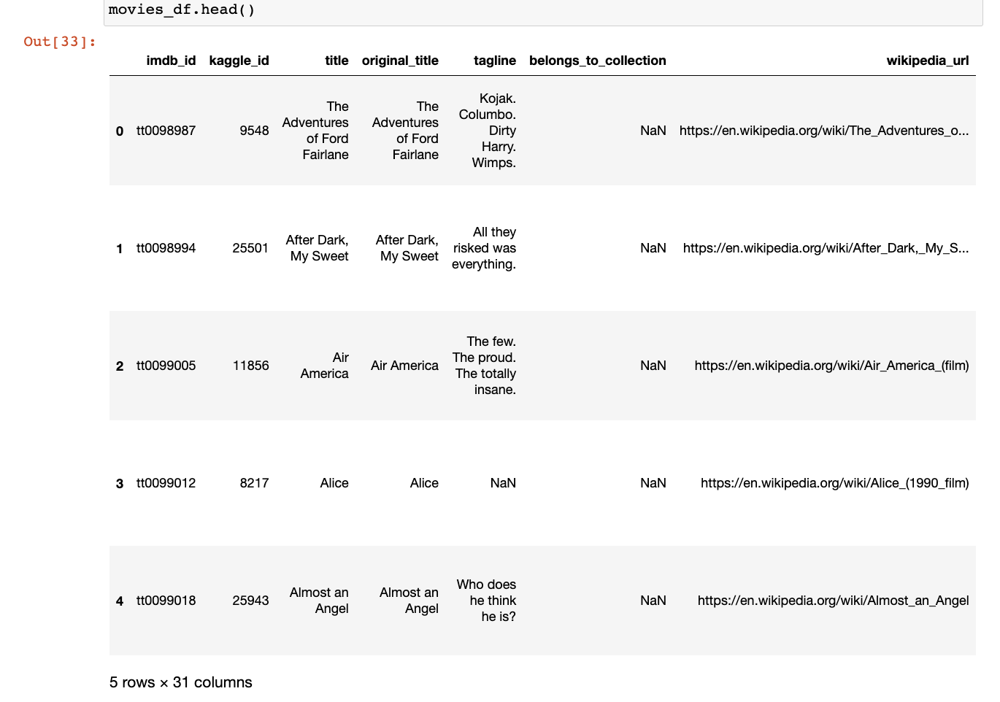
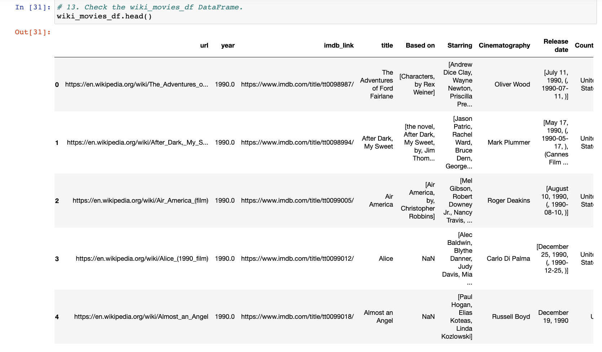
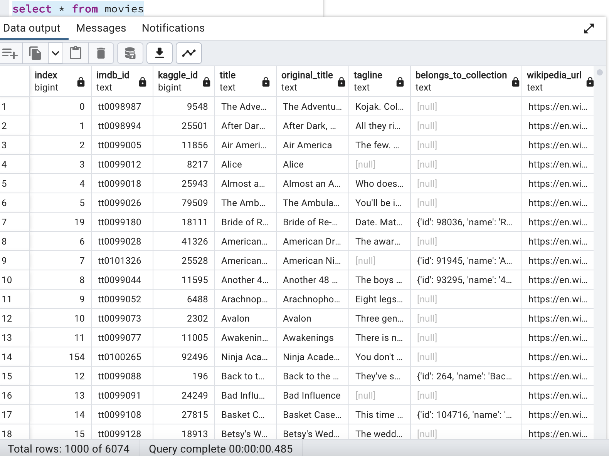
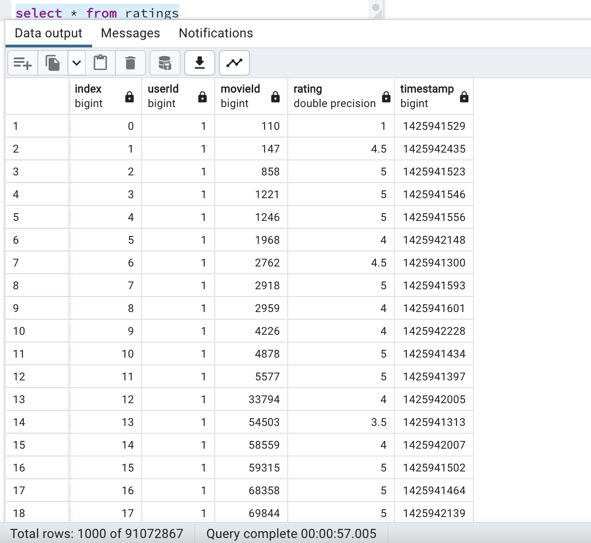

# Movies_ETL

## Overview and Purpose

The purpose of this project is to perform an extract, transform, load pipeline that reads data on movie titles and ratings and load them into existing tables on PG Admin. 

## Analysis

This project required a long data transformation and load into Postgres which took many tries. However at the end, the table was successfully loaded with about 6000 rows for the movies table.
