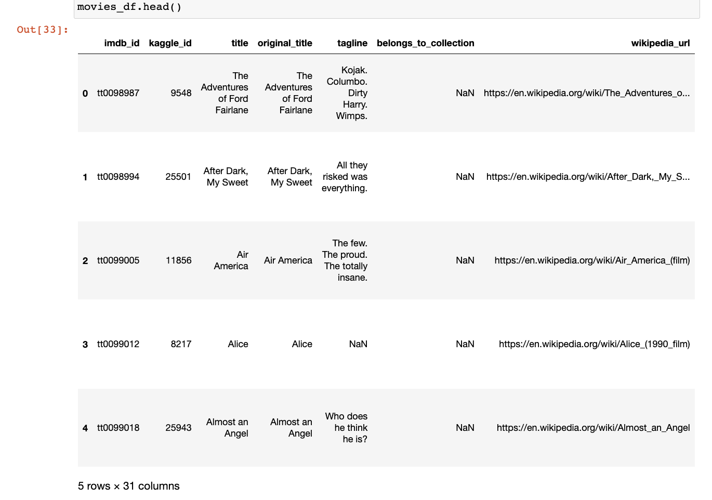
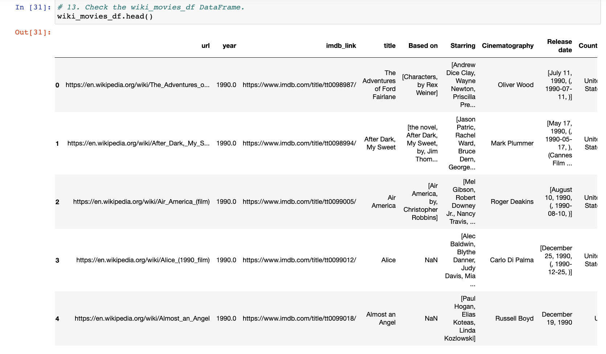
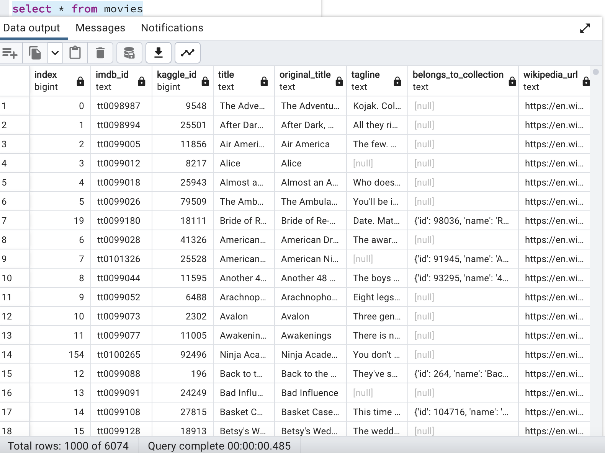
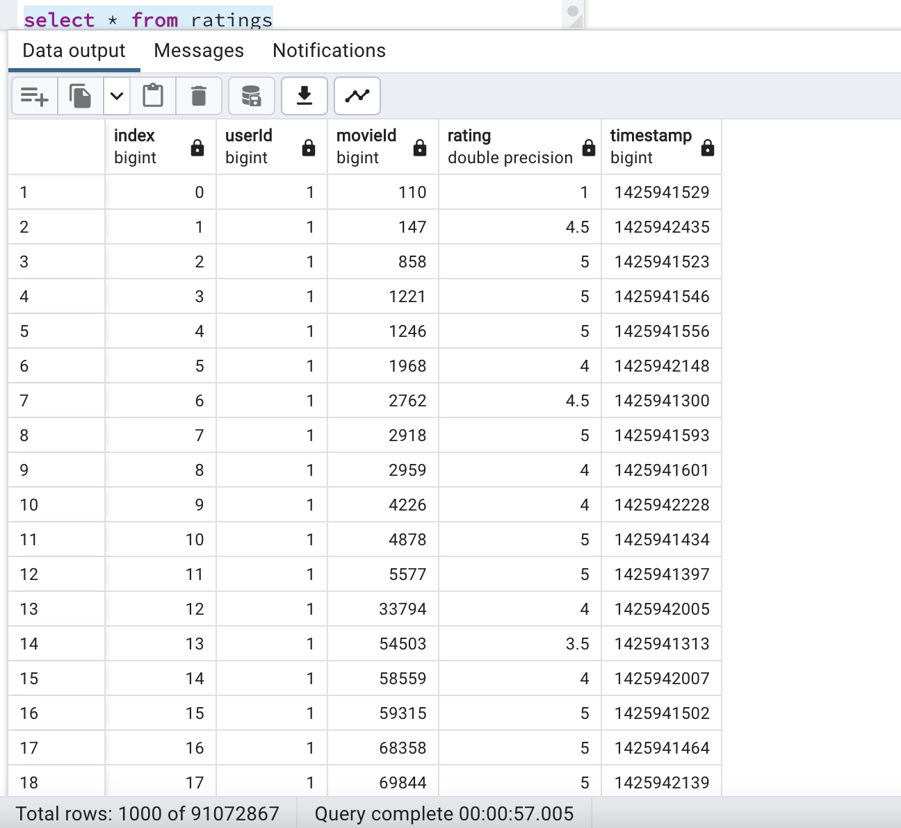

# Movies ETL

## Tools used

• PGAdmin
• Python
• Postgres
• SQL

## Overview and Purpose

The purpose of this project is to perform an extract, transform, load pipeline that reads data on movie titles and ratings and load them into existing tables on PG Admin. This process will take place in three stages: Extraction, Transformation, and Loading, as the title of this project suggests. The extraction and transformation will take place on Jupyter Notebook using Python and after that is completed, the transformed data will be loaded into PGAdmin, where the full table will be displayed.

## Analysis

This project required a long data transformation using Jupyter Notebook. After the data was successfully processed using Python began the load process. For this stage, the transformed data was loaded into Postgres which took many tries. However at the end, the table was successfully loaded with about 6000 rows for the movies table.
